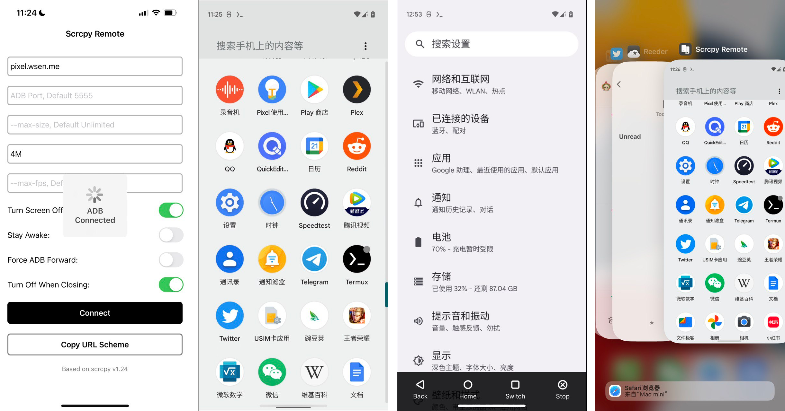

# scrcpy-mobile

Ported scrcpy for mobile platforms, to remotely control Android devices on your iPhone or Android phone.

*Currently only supports controlling Android devices from iOS, Android controlling Android devices will be supported in futrue.*



## Features

* Supports scrcpy with ADB over WiFi ;
* With Hardware decoding, less power and CPU comsumed;
* Optimized gesture experiences for unstable network from mobile devices;
* Supports start scrcpy from URL scheme;

## Installation

Scrcpy Mobile is now available on the App Store. You can download from:

[](https://apps.apple.com/us/app/scrcpy-remote/id1629352527)

## Usage 

**ADB Mode**: After the App is installed, the default mode is VNC. If you need to switch to ADB WiFi mode, please visit this URL Scheme: [scrcpy2://adb](scrcpy2://adb)

And then please make sure that the Android devices has enabled the **adb tcpip** mode:

```sh
adb tcpip 5555
```

**VNC Mode**: Visit the URL scheme [scrcpy2://vnc](scrcpy2://vnc) to switch back to VNC mode.

*Note: The VNC mode can only connect the VNC port that be proxied with websockify, and it's based on noVNC which is a web vnc client, so the performance and experience may not good.*

**URL Scheme:** After changed the options, you can click "Copy URL Scheme" to get the URL Scheme string, and you can create a shortcut in Shorcuts.app for connecting to scrcpy quickly.

```
scrcpy2://example.com:5555?bit-rate=4M&max-size=1080
```

**Telegram:** If you still have any question, you can join telegram channel:

[Scrcpy Issues](https://t.me/joinchat/I_HBlFpB27RkZTRl)

## Build

Build all dependencies:

```sh
make libs
```

Build `scrcpy-server`:

```sh
make -C porting scrcpy-server
```

Then, Open `scrcpy-ios/scrcpy-ios.xcodeproj` to Build and Run.

## License

```
MIT License

Copyright (c) 2022 Ethan

Permission is hereby granted, free of charge, to any person obtaining a copy
of this software and associated documentation files (the "Software"), to deal
in the Software without restriction, including without limitation the rights
to use, copy, modify, merge, publish, distribute, sublicense, and/or sell
copies of the Software, and to permit persons to whom the Software is
furnished to do so, subject to the following conditions:

The above copyright notice and this permission notice shall be included in all
copies or substantial portions of the Software.

THE SOFTWARE IS PROVIDED "AS IS", WITHOUT WARRANTY OF ANY KIND, EXPRESS OR
IMPLIED, INCLUDING BUT NOT LIMITED TO THE WARRANTIES OF MERCHANTABILITY,
FITNESS FOR A PARTICULAR PURPOSE AND NONINFRINGEMENT. IN NO EVENT SHALL THE
AUTHORS OR COPYRIGHT HOLDERS BE LIABLE FOR ANY CLAIM, DAMAGES OR OTHER
LIABILITY, WHETHER IN AN ACTION OF CONTRACT, TORT OR OTHERWISE, ARISING FROM,
OUT OF OR IN CONNECTION WITH THE SOFTWARE OR THE USE OR OTHER DEALINGS IN THE
SOFTWARE.
```

